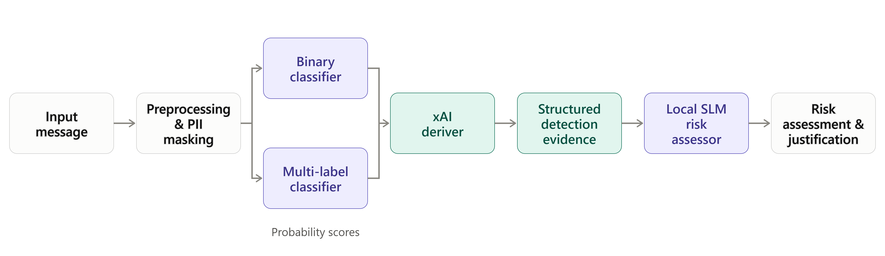

# Augmentation of SLM Risk Assessment with Explainable Social Engineering Detection Evidence

## Project Overview

This project investigates whether explainable evidence from a social engineering detection system can improve the reliability and quality of risk assessments produced by a small language model (SLM).

The system combines:

- Binary malicious-message detection
- Multi-label social engineering technique detection
- Explainable AI (XAI)
- Structured evidence generation
- Local SLM-based risk assessment

The complete pipeline operates locally, without requiring external LLM APIs for core inference.

## Research Aim

The project evaluates three risk-assessment conditions using the same underlying messages:

| Condition | Evidence Provided |
|---|---|
| **No Evidence** | Original message only |
| **Baseline Evidence** | Evidence from TF-IDF + Logistic Regression |
| **BERT Evidence** | Evidence from ModernBERT-based detection |

The aim is to determine whether model-derived evidence improves the quality and reliability of downstream SLM risk assessments.

## System Pipeline



Detection evidence includes malicious probability, risk level, token-level evidence, and detected social engineering techniques. Evidence is provided as supporting information rather than ground truth.

## Dataset

The project uses an enriched dataset of approximately 51,000 benign and malicious messages collected from nine public datasets.

Messages are annotated with ten social engineering techniques:

- Urgency
- Authority
- Fear
- Reciprocity
- Curiosity
- Pretexting
- Promotional
- Transactional
- Reminder
- Personal

PII and potentially sensitive information are masked during preprocessing. Exact duplicates and highly similar messages are also removed to reduce data leakage.

## Models

### Detection

Two detection approaches are used:

- **TF-IDF + Logistic Regression** — baseline
- **ModernBERT-base** — transformer-based model

The system also performs multi-label technique classification and probability calibration so that detection outputs can be used as downstream evidence.

### Explainability

The project uses token-level XAI methods including:

- LIME
- SHAP
- `transformers-interpret`

### Risk Assessment

A locally hosted **Gemma 2 9B** model acts as the SLM risk assessor.

Risk assessments use four levels:

- Low
- Moderate
- High
- Critical

The SLM is instructed to independently assess the original message and use supplied detection evidence to support, challenge, or refine its reasoning.

## Evaluation

The final experiment evaluates 50 messages under all three conditions, producing 150 risk assessments.

Assessment quality is evaluated using a local **llama3.1:8b** model through a G-Eval-style evaluation framework. Five quality dimensions are assessed:

- Relevance
- Justification Soundness
- Contextual Awareness
- Accuracy
- Guidance Appropriateness

Objective validation additionally compares the generated risk levels against the original binary dataset labels.

Statistical analysis uses repeated-measures non-parametric tests, including Friedman's test and pairwise Wilcoxon signed-rank tests with Bonferroni correction.

## Installation

### Requirements

- Python 3.10+
- NVIDIA GPU with CUDA support recommended
- Git
- Sufficient storage for datasets and model checkpoints

The project was developed using an NVIDIA RTX 3060 Ti with 8 GB VRAM.

### Setup

```bash
git clone <repository-url>
cd <repository-directory>

python -m venv .venv
```

Windows:

```bash
.venv\\Scripts\\activate
```

Linux/macOS:

```bash
source .venv/bin/activate
```

Install dependencies:

```bash
pip install -r requirements.txt
```

## Usage

The intended workflow is:

### 1. Prepare the Dataset

Run the preprocessing pipeline to clean the source data, mask PII, apply annotations, deduplicate records, and generate the required dataset splits.

You can skip this step by downloading the splits.zip file in the "Pre Data Splits" release that contains the preprocessed and enriched data used for the workflow.

### 2. Train the Detection Models

Train the binary and multi-label detection models. The models can also be loaded by the models.zip file inside the repository.

```bash
python -m scripts.<training-script>
```

### 3. Calibrate the Models

Run probability calibration using the designated calibration data.

```bash
python -m scripts.<calibration-script>.py
```

### 4. Generate XAI Evidence

Generate structured detection evidence for the input messages.

```bash
python -m scriptsformulate_xai_evidence
```

### 5. Run Risk Assessment

Run the local SLM using one of the three experimental conditions:

```text
no_evidence
baseline_evidence
bert_evidence
```

Before running the script below, make sure you download the Gemma 2 9B model on LM Studio that is running live on your local device endpoint.

```bash
python -m scripts.generate_risk_assessments
```

### 6. Evaluate Results

Run the evaluation pipeline on the generated assessments.

```bash
python -m scripts.evaluation_risk_assessment
```

## Repository Structure

```text
data/
models/
prompts/
experiments/
results/
notebooks/
src/
scripts/
requirements.txt
README.md
```

## Limitations

This repository contains a research prototype rather than a production security system.

The results are limited by factors including dataset annotation quality, the subjectivity of social engineering labels, XAI attribution limitations, the relatively small evaluation sample, and the limitations of automated LLM-based judging.

Further validation using larger datasets and human security-expert evaluation is required before the approach could be considered suitable for operational deployment.

## Academic Context

Developed as part of the **AIML339 Capstone Project** at Te Herenga Waka—Victoria University of Wellington.

The accompanying report contains the detailed methodology, experimental results, statistical analysis, ethical considerations, limitations, and future work.
